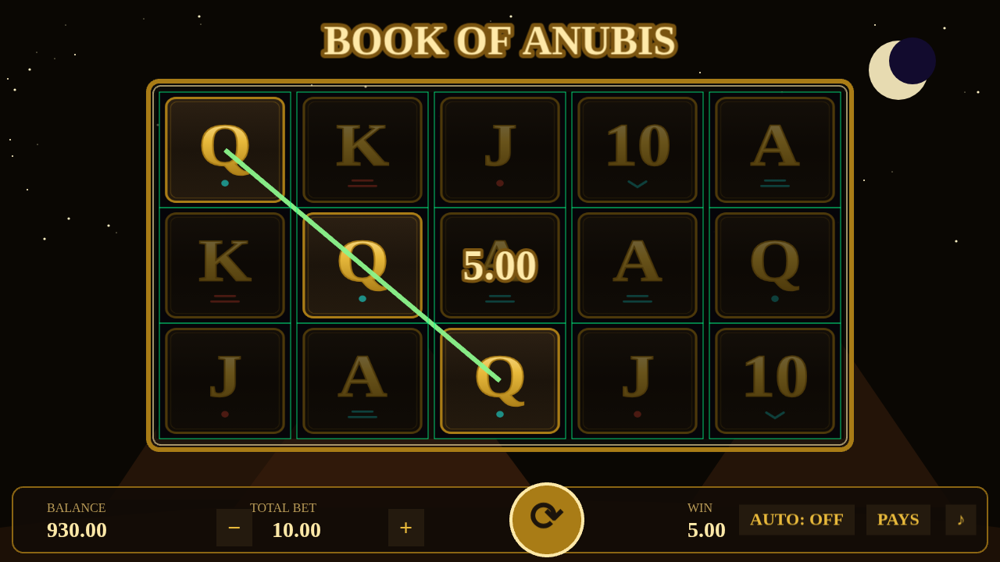

# Book of Anubis 🏺

A realistic, casino-grade Egyptian-themed slot game built with **Phaser 3** + **TypeScript** + **Vite**.
Zero external assets — every symbol is an inline SVG, every sound is WebAudio synthesis.



## Game

- 5×3 reels, 10 paylines (Novomatic-style line set)
- **BOOK** is wild *and* scatter: 3+ anywhere pay and award **10 free spins**
- Free spins feature a randomly chosen **expanding special symbol** that pays by
  *number of reels*, positions need not be adjacent or on a payline (Book of Ra rule);
  retriggers supported
- Bet levels, balance, autoplay, paytable overlay, spin anticipation, win presentation

## Casino-grade math

The math core (`src/core/`) is pure TypeScript with no Phaser/DOM/Node dependency —
the browser game and the Node simulation import the exact same modules, and the
frontend **never computes outcomes**: it only animates fully-resolved `SpinResult`s.

- **Par-sheet model**: each reel is a fixed circular strip generated from per-reel
  symbol *count tables* (`src/core/config/weights.ts`). One uniform RNG draw per reel
  picks the stop; all probability lives in the strip composition, exactly like
  certified real-world slots.
- **RNG**: seedable Xoshiro128\*\* with rejection sampling (no modulo bias).
- **Three volatility profiles** (`low` / `medium` / `high`), each tuned to **96.0% RTP**.
- Verified three independent ways:

| Check | Command | Result (medium) |
|---|---|---|
| Exact analytic calculator | `npm run calc` | 95.97% total (line 61.5% + scatter 1.9% + feature 32.6%) |
| Monte Carlo, 5M spins | `npm run simulate -- --spins 5000000` | 96.5% ± 0.78 (analytic inside CI) |
| Monte Carlo, 20M spins | `npm run simulate -- --spins 20000000` | 95.7% ± 0.36 |

Base-game hit rate ≈ 33% (1 in 3 spins); the feature triggers ≈ 1 in 162 spins with an
average value of ≈ 53× total bet — the same starved-base / heavy-feature shape as the
original Book of Ra (a 96% game with these expanding-symbol pays mathematically cannot
trigger much more often).

## Commands

```bash
npm install
npm run dev            # play at http://localhost:5173
npm test               # 35 unit tests (RNG, strips, evaluator, session, RTP smoke)
npm run calc           # exact analytic RTP breakdown per profile
npm run simulate -- --spins 5000000 --seed 7 --volatility medium --histogram
npm run tune           # par-sheet grid tuner (prints candidate count tables)
npm run build          # production build
```

### Dev/debug query flags

| Flag | Effect |
|---|---|
| `?volatility=low\|medium\|high` | pick the par-sheet profile |
| `?seed=123` | deterministic session |
| `?debug=1` | cell grid overlay + `SpinResult` logged to console |
| `?forceBook=1` | next spin fast-forwards the RNG to a feature trigger |

## Architecture

```
src/core/    pure math: types, RNG, paylines, paytable, weights (par sheet),
             strip generator, evaluator, slot engine, session state machine
src/sim/     Node-only: Monte Carlo harness, Welford stats, exact analytic
             RTP calculator, par-sheet tuner
src/game/    Phaser 3: Boot/Preload/Game/UI scenes, reel objects (update-loop
             scroll with teleport approach + bounce), win painter, expanding
             overlay, WebAudio sound factory, inline-SVG symbol set
src/test/    vitest suites
```
